<!--
  This is my PROFILE README. It lives in the repo named exactly after my
  username (github.com/jpool09/jpool09) so GitHub shows it on my profile.
  Widths 370/490 keep the portrait and info card the same height.
-->

<table>
<tr>
<td valign="top"></td>
<td valign="top"></td>
</tr>
</table>

## Jean Pool Cruz

**Product Owner · Full Stack Developer · Blockchain**

 

<!-- animated contribution graph, refreshed daily by the workflow -->

